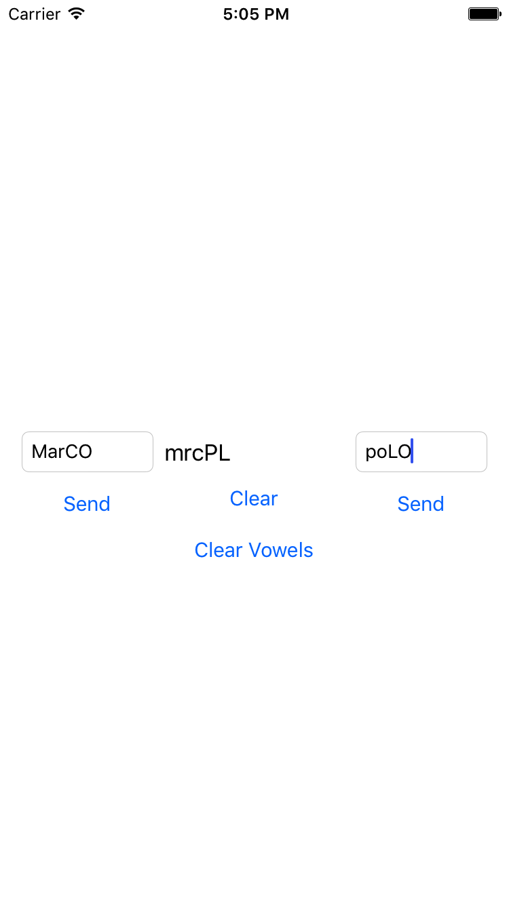

# CS 11 Swift/iOS
## Lab 2: Basic Interface Building

---

### Guidelines for submission

[Create a Git repository](gitguide.md) for your Xcode project, and when you're
done, submit a link to the repo and a commit hash you'd like us to grade.

[Interface Builder Intro](ibintro.md)

---

### Part A - The entire assignment

In this assignment, you're going to write a very simple (slightly contrived) 
app to practice using
Interface Builder, while also getting a little more advanced with Swift
Strings.

Here's what you should build:

#### Interface 

Two text fields, a text label, and four buttons.
You can arrange these however you want, with the following rules:

- Arrange them for use on an iPhone
8 (The smaller one) - at a bare minimum, I should be able to see all of these
UI elements, and really you should try to lay them out in some nice way.
[Here](https://developer.apple.com/library/content/referencelibrary/GettingStarted/DevelopiOSAppsSwift/BuildABasicUI.html#//apple_ref/doc/uid/TP40015214-CH5-SW2) is some information on using Auto Layout constraints to make sure your apps
look good on all device sizes. This is not a requirement for the lab but
is an essential skill.
- One text field should be clearly on the left side of the screen, and one
should be on the right.
- Two of the buttons correspond to the two text fields, and
it should be obvious which text field each button corresponds to.
- These two buttons should read `Send`, and the other two buttons should
read `Clear` and `Clear Vowels`.

Here is a screenshot of an example:

#### Behavior

The text label and both text fields should start out empty.
When either `Send` button is pressed, the text in the field corresponding to
that button should be concatenated onto the text label, with the caveat that
when the left button is pressed, the text in the left field should be changed
to all lowercase letters before being appended to the label, and the text
in the right field should be changed to all uppercase letters.

When the `Clear` button is pressed, the text label should be cleared, and when
the `Clear Vowels` button is pressed, all of the vowels in the text label
should be removed.

See the screenshot for an example.

Some tips/information:

I recommend first mocking up your user interface in Interface Builder - you
can get there by clicking on the Main.storyboard file in your project's
explorer. Interface building is very straightforward (at least, for something
this uncomplicated), it's pretty much drag-and-drop.

You can either use the [Swift string documentation](https://developer.apple.com/documentation/swift/string)
to figure out how to do
things like removing all the vowels, or write your own functions to do this
kind of thing.
