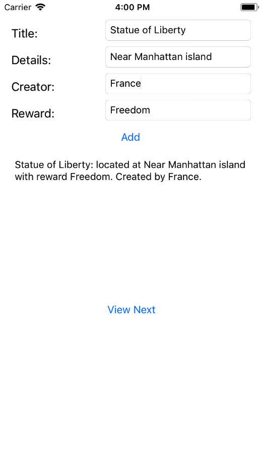
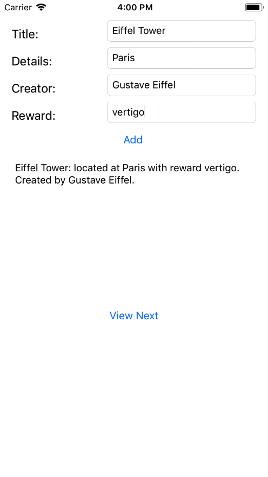

# CS 11 Swift/iOS
## Lab 3: MVC Design and Persistent Storage

---

In this assignment, we're going to learn about the Model-View-Controller
design pattern, which is extremely common in iOS development. We're also
going to start working on the main app that these labs will build, which
will be a geocache/photo sharing app. This will be
substantially harder than the last two labs, so plan ahead and give yourself
plenty of time.

---

### MVC Introduction

In MVC, the
Model is the raw data object, and its associated operations. This is your
data structure layer, where the "real" programming and computation will
usually happen. The View is the opposite layer, the interface that's presented
to the user, with all its text fields and buttons and nice stuff.
Sitting between the Model and the View is a Controller, which takes the
actions performed on the interface, uses them to update the Model, and
also updates the View to be consistent with the data in the Model layer.

What you'll be writing today will put together the UI elements we used last
time with a data structure that persists between UI invocations. The main screen
(only screen this time) of the App will have four text fields, for the user to
enter the basic information associated with a geocache. There will also be
two buttons, one which takes the information in the text fields, stores it in
a custom GeoCache object, and adds it to a list of such objects. The other
button will cycle through the GeoCache objects that have been entered,
displaying their information one at a time whenever it's pressed in a text
view on the screen. The list of GeoCache objects will be saved between App
launches, so that the user's data isn't lost when they quit the application.

### Part A - Model

The app we're building is a geocache app, so the main object we're
going to have to model is a geocache. 
A geocache is a hidden treasure, usually with an actual physical box and a
notebook for people to sign if they find it, with its location recorded when
it's hidden so that someone with a GPS device (a phone works really well)
can find it later.
For now, in code this will be a simple struct
holding a few text fields, but it will grow to include more information in
future labs.

Quick note - Structs vs Classes

Swift has Structs and Classes,  which share many features (both can have
members, initializers, and other methods, and both can conform to protocols),
but have a couple key differences.
For more information, you can turn to The Swift Programming Language - the
major differences are that Classes can inherit from other Classes (though
many programmers in object oriented languages are moving away from Class
inheritance in favor of protocol-like systems), and that Classes are passed
by reference, while Structs are copied when passed around.

Do part A of this application in a new .swift file called `GeoCache.swift`.

You should write a `struct` called `GeoCache` with these members,
all Swift strings:

- `title`: A title for the geocache.
- `details`: Additional details for the geocache.
- `creator`: The name of the creator.
- `reward`: A string describing what can be found at the cache.

In addition, our struct is going to need a couple of methods to allow us to
store them persistently on users' devices (persistent between launches of the
application). In this lab, we're going to be using UserDefaults to persist
data, which requires that our data conform to some old protocols from
Objective-C. The easiest way to make a Swift struct work with UserDefaults
is to make it easily convertible to/from a Swift dictionary. This will also
come in handy later, when we want to talk JSON to a server. So, you'll need to
write these methods:

- `init?(fromDictionary dict: [String: String])`: A failable initializer which
takes a dictionary, which should have values for the keys "title",
"details", "creator", and "reward". If all of these are present, the
initializer should set up the members of the struct according to the values
in the dictionary. If any of these is missing, however, the initializer should
return `nil`. These types of optional initializers are very helpful in Swift,
when it's possible the data you're pulling in could be incorrect or
initialization could otherwise fail.  
The `guard let` syntax is very helpful in writing this initializer.

- `dictionary: [String: String]`: This is actually not a method, but rather a
computed property (see The Swift Programming Language or the lectures). Given a
GeoCache `geo`, this computed property should return a dictionary where
using the dictionary as an argument to the above initializer would
yield an identical struct to `geo`.

- `description: String`: This is another computed property which is not actually
used for persistent storage, but will allow the struct `GeoCache` to conform
to the CustomStringLiteral protocol, which allows us to write `print(geo)` if
we want to print out a representation of the geocache. This property is more
freeform, the only rule is that it contains each of the GeoCache's members in
some recognizable form. Use string interpolation, and make it pretty!

#### Persisting a list of GeoCaches

We're going to do a little bit more work in the model layer before moving on
to the view and controller - we'll write a couple of functions for reading and
writing instances of our struct from the simplest of the iOS persistent
stores - UserDefaults.

There are many ways to store data persistently between app invocations on iOS,
ranging from lightweight key-value-stores like UserDefaults to CoreData and
SQLite databases. For our purposes in this lab, UserDefaults will do just fine,
because all we need to store is a list of these simple GeoCache objects.

UserDefaults allows you to store data that conforms to the NSCoding protocol.
In pure Swift, it's very easy to store anything of a basic type (String, Array,
Dictionary, compositions of these), and that's what we'll do.

Saving something to UserDefaults looks like this:

`
let defaults = UserDefaults.standard  
defaults.set("Marcus", forKey: "name")  
defaults.synchronize()  
`

And retrieving an object for a key is done like this:

`
let name = defaults.string(forKey: "name")
`

Where you use different methods on the defaults object depending on what type
of object is stored for that key (see the [documentation](https://developer.apple.com/documentation/foundation/userdefaults) for details).

We're going to
keep track of an Array of GeoCache objects, and keep it saved in UserDefaults.
For this we'll need two functions, a save and a load function, which work as
follows:

- `loadCachesFromDefaults() -> [GeoCache]`: This will look up an array in
UserDefaults, and attempt to convert each element in the array into a
dictionary of type [String: String], feed those into the failable initializer
for `GeoCache`, and return an array of those results.

- `saveCachesToDefaults(_ caches: [GeoCache])`: This will take an array of
GeoCaches (with no argument label) and save it to the standard UserDefaults,
so that if you immediately loadCachesFromDefaults() you will get back the same
array you just saved. You can use whatever key makes sense to you in the
UserDefaults for these functions.

Now our data model has all the features we'll need to create a functional
(if not exactly useful yet) application, so we can move on to the View!

### Part B - View

The view will be the most straightforward of these parts. All you have to do
is lay everything out in Interface Builder. There are screenshots below -
as before, lay this out so it looks good on the iPhone 8 simulator, and
optionally use autolayout constraints to make it nice on all size classes.

You need four fields, one for a Title, one for Details, one for Creator,
and one for a Reward. You need two buttons, one which will take whatever's
written in the text fields and create a GeoCache with that information, and
one which will cycle through the created GeoCaches, displaying the description
of each one in turn. For this, you need a text view (which is like a Label
for larger text - a rule of thumb is that if it needs to wrap, use a text
view instead of a label).

Once the view is ready, we can start writing the ViewController, and hook
everything up together.

### Part C - Controller

The Controller part of MVC design lives in one or more ViewController classes
that inherit from UIViewController. We've talked a little bit about
UIViewController in the last lab, and Xcode starts us off with a skeletal
ViewController but this time our ViewController has to be
a little more complicated. Here's what you'll need to add:

A member which is a list of GeoCache objects, which is initially empty.

It should have IBOutlets for each text field in the geocache, named
titleField, detailField, creatorField, and rewardField. These should be of
type UITextField. It should also have
an IBOutlet for the label, called cacheLabel, of type UITextView.

It should have two IBActions:

- `addGeoCache`: This should take whatever's entered in the four text fields,
and use them to create a new GeoCache. If any of the fields are empty, this
should put an error message in the cacheLabel. If constructing the GeoCache
fails for another reason, this can just be a no-op. Once it creates the new
cache, it needs to add it to the list of caches, and _save_ the list of caches
to the UserDefaults, using one of the methods from the Model.

- `nextCache`: This should cycle the cache displayed in the cacheLabel, moving
to the next cache in the list in a cyclical fashion, and setting the text in
the label to the description property of that GeoCache.

You can add whatever other members to the ViewController you need to make this
happen.

In addition, you need to make sure the ViewController loads the saved GeoCaches
from the UserDefaults when the app is started. This type of operation is
typically performed in the viewDidLoad() method.

If the Model is written well, this part should be fairly straightforward.

As before, submit your work to moodle by giving us a link to a github
repository with your project and a commit hash to grade.
You'll be improving on this project every lab from now on, so you'll use the
same repository for the rest of the class.
