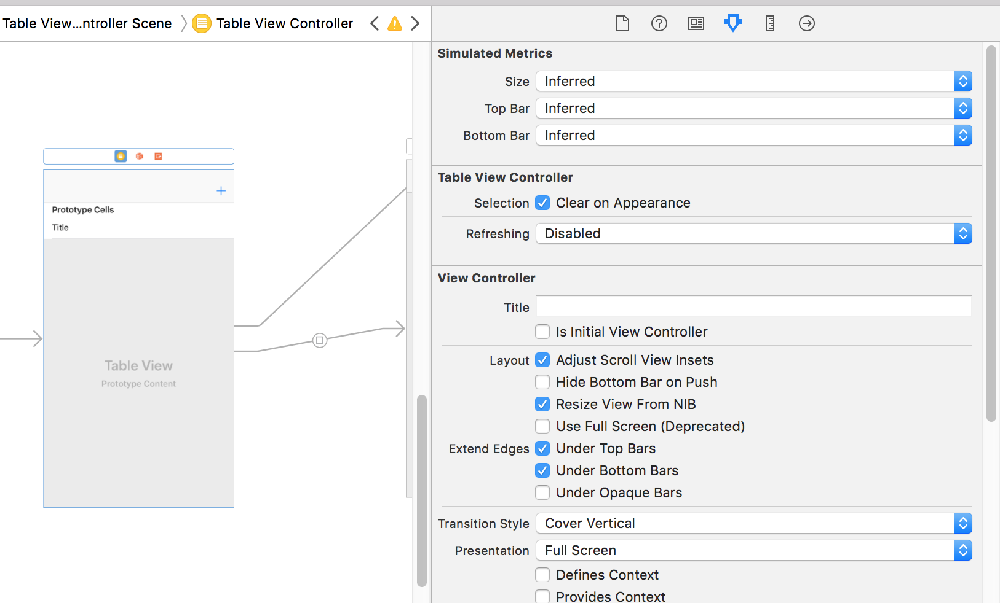
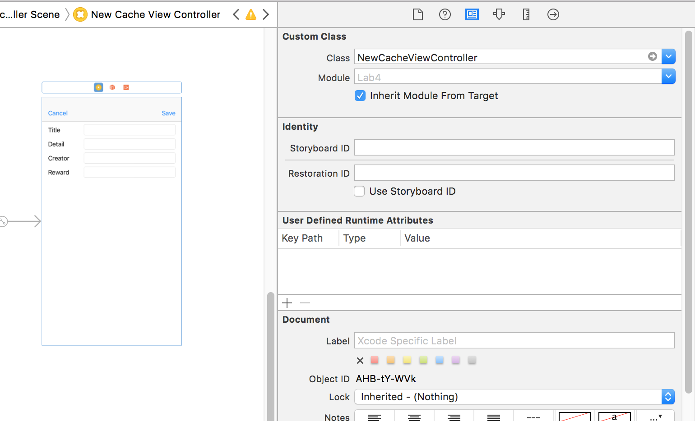
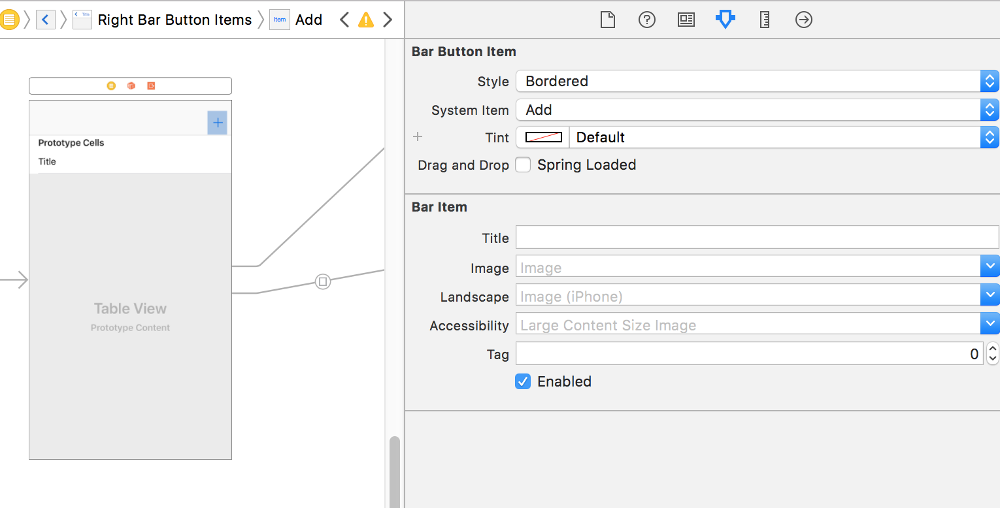

# CS 11 Swift/iOS
## Lab 4: Table Views, Multiple View Controllers

---

In this assignment, we will cover possibly the most frequently-used piece of
UI in iOS - the Table View. Whenever you need a vertically scrolling list of
content, you're probably going to use UITableView. So, let's jump right in,
starting from your completed Lab 3.

Note: This roughly follows the sequence of steps in
[this](https://developer.apple.com/library/content/referencelibrary/GettingStarted/DevelopiOSAppsSwift/)
tutorial, so if you find our instructions here unclear or need more
clarification on how to do things, check it out!

---

### Part A: View

We'll start by adding a Table View Controller to your main.storyboard file.
You can find these over on the object viewer panel, drag one onto the
storyboard and you should get a new little screen in the storyboard, with
a thing at the top marked `Prototype Cells`. Set this View Controller to be
your Initial View Controller (there's a checkbox for this in one of the tabs
on the right). You shouldn't remove your old view, we'll be using it soon!

We're also going to have to set up this `Prototype Cells` thing - this is an
interface builder way of styling your table view so that cells you create
programmatically all look good. Click on the cell at the top of your new table
view and the properties tab on the right should say Table View Cell, with
some options for `Style` and `Identifier`. Choose a basic style and type
any identifier you want - I used `basicCell`. Now we're ready to write code,
woo.

---

### Part B: Controller

Create a new class, call it TableViewController (Xcode should automatically
make this a subclass of UITableViewController). You will notice not just the
normal `viewDidLoad`, etc, but also some functions related to table views:

- `numberOfSections(in tableView: UITableView) -> Int` returns the number of
sections in the table view. Your table views are broken up into sections,
and each section can have a header, etc. In this class, we'll pretty much only
need 1 section, so you can just make this return 1.
- `tableView(_ tableView: UITableView, numberOfRowsInSection section: Int) -> Int`:
The first of a couple of weirdly named methods (these are holdouts from the
Objective-C days). This takes a section, and returns the number of rows in that
section. Since we only have one section, you can ignore the section getting
passed in and return the number of caches stored in the app. (Note: The
Table view will be our default and starting view from here on out, so it
should now keep track of the array of GeoCache objects.)
- `tableView(_ tableView: UITableView, cellForRowAt indexPath: IndexPath) -> UITableViewCell`:
This is the meaty function of table views. This takes an index path (which you
can view as simply containing a (section, row) pair, and returns a
UITableViewCell - When your table view loads its data, it will get the number
of sections, the number of rows in each section, and then for every row in
every section call this function to decide what to put in that cell.
You won't have to do much here that isn't already done, besides getting a
cell for the Reuse Identifier you chose and setting its text to the title
of the geocache at the row in the IndexPath.

There are some other Table View functions that we won't look into, but take a
look at the comments and docs if you're interested!

You can start by getting the Table View to display the titles of all of the
geocaches stored in the UserDefaults store we used before. This should be
pretty self-explanatory. Keep the same array of GeoCache objects as the last
lab's view controller, but instead of having a button to cycle through which
geocache is displayed, change this tableView cellForRowAt indexPath method to
create a new `basicCell` (or whatever you called it) and populate its text
with the title of the geocache corresponding to the row in the index path
in the array.

Now is also a good time to change the old ViewController's class so that we
can distinguish what its responsibilities are. Change the file name and class
name of the old ViewController to NewCacheViewController(.swift). You should
also go into interface builder and change the class of the view controller
for the view with those four text fields - this is in the properties menu.

Now is also a good time to make a couple changes to the NewCacheViewController:
Since the table view controller is now keeping track of the full list of
GeoCache objects, the NewCacheViewController is only responsible for keeping
track of one of these objects - the one the user is currently creating.
remove the [GeoCache] typed property from the NewCacheViewController, and
replace it with `cache` - a property of type `GeoCache?` which defaults to
`nil`, so that if for some reason the user is unsuccessful at creating a
new GeoCache we can handle it and not add anything to the list. You can also
remove the logic that saves and loads the cache list to UserDefaults - the
loading can happen in the TableViewController right now, but we'll handle
saving once we're ready for this NewCacheViewController to pass the cache
the user is creating back to the TableViewController.

### Part C: Segues

At this point, your table view app is pretty crappy - there's no way to add a
new geocache, or to view details on any of the geocaches the user can see
besides their title. We'll need different screens besides the table view to
get this functionality - this is where Segues come in. Segues allow you to
move between different view controllers (screens) in your app, passing data
between them if necessary. We'll create two new view controllers, one for
creating a new geocache, and one for displaying the details of a geocache in
the table, and use two different Segues to hook everything up.

You should still have your old view with text fields for entering a new
geocache. We're going to hook that up to the table view that is now our
initial view controller. First, we need to add a button to the table view that
will take us to the new cache view controller. The standard way to handle
navigating around multiple view controllers is a navigation controller, which
provides the top bar you see often in applications that has back, plus, and
cancel-type buttons, along with a title occasionally. This type of navigation
is starting to fall in favor, since phones are getting bigger and it can be
hard to reach the navigation buttons - check
[this post](https://medium.com/tall-west/lets-ditch-the-nav-bar-3692cb17cc67)
out if you're interested. For now, we'll stick with the basics - navigation
bars are still used by plenty of apps, including system things like settings.

What we need to do first is embed our table view in a navigation controller.
Select it in main.storyboard, and in the top menu select
editor -> embed in -> navigation controller. A new card should appear for
the navigation controller, and the table view should get a grey bar at the
top. This is the navigation bar, and it's where we'll put buttons - find a
Bar Button Item in the toolbox and drag it onto the right side of the bar.
Give it a plus sign icon by going into its properties - where it says
Style - Bordered, change the System Item property to Add.

Since the new cache view controller will need a Cancel and a Save button, you
should also embed it in its own navigation controller. Once this is done, we
are ready to hook these two views up with a segue! You just need to
control-drag from the + bar button to the other view's navigation controller.
A little menu should pop up, these are the different types of segues you can
use. Select "Present Modally." Now there should be a cool arrow between these
two view controllers.

We have a few more things to do in Interface Builder - We need to add
bar buttons for Cancel and Save to our new cache view controller, and hook
those up so that they go back to the table view. We're also going to add yet
another view, so that when the user taps on one of the cells of the table view,
they get taken to a screen that shows them the detailed information on the
geocache. Drag a couple more Bar Button Items onto the navigation bar of the
new cache view, onto the left and right. Make the left one the System Item
"Cancel", and the right one the System Item "Save". We need to have IBActions
to hook these up properly, so let's add those. To the _TableViewController_,
we need to add an "unwind" method. The signature is

`@IBAction func unwindToTable(sender: UIStoryboardSegue)`

and it needs to do a couple things. It should make sure that the `source`
property of the sender parameter can be cast to a `NewCacheViewController`, and
that the optional `cache` property of this source is not nil. If either of
these conditions is not satisfied this method can just do nothing (one of
these situations should never arise, and one of them corresponds to the user
pressing the cancel button). Once this method has the new cache from the
source of the segue, it needs to create a new IndexPath at the row
corresponding to where the new cache's row will be (section 0, like all of our
rows). It should add the new cache to its list of caches. Then it should call
the `tableView.insertRows(at: [IndexPath], with: )` method to get a nice
animation for a new row being added. This is also where you should save the
cache list to the user defaults, since the list has changed.

The NewCacheViewController also needs an IBAction, with this signature:

`@IBAction func cancel(sender: UIBarButtonItem)`

which simply sets the cache property to `nil` (just in case it isn't already)
and calls the `dismiss` method, with an animation but no completion closure.

Now we can hook these buttons up - go back to Interface Builder and hook up
these buttons by control-dragging from them. Control-Drag from the Save
button to the
"Exit" icon at the top of the new cache view controller - It's the right-most
of the three yellow and orange icons at the top of the view controller.
You should see a little menu, select `unwindToTableWithSender:`. Connect the
Cancel button to the cancel IBAction by dragging from it to the leftmost of
those icons (representing the NewCacheViewController), and selecting
`cancelWithSender:`.

Next, we need to make sure that when the Save button is pressed, a new cache
is ready for the TableViewController to put in its table. We will do this in
a `prepareForSegue` method on the NewCacheViewController.

There's a lot of methods involved in a segue, and it can be hard to know where
to put what. [Here's](https://developer.apple.com/library/content/featuredarticles/ViewControllerPGforiPhoneOS/UsingSegues.html)
a good primer on this topic, that talks about when everything happens.

`prepare(for segue: UIStoryboardSegue, sender: Any?)` is a method of the
NewCacheViewController called when it initiates a segue. You have already
written a lot of the logic for this method in lab 3 - it will do the reading
from the text fields and create a new GeoCache object from their values,
then set its own `cache` property to the new object, if it is successfully
created. This will allow the TableViewController to read the new cache
from the sender in its `unwind` method.

This is a good time to check that this stuff is all working. Then, we'll
add a detail view - a third view controller!

This will go a lot like hooking up the table and new cache view controllers -
drag a new View Controller onto the storyboard, create a new class for it
(DetailViewController). You should put a Text View on the detail view
controller, and add an IBOutlet to the new class for it. You can also embed
the detail view controller in its own navigation controller, so the bar
will persist even when the user hits a geocache row and moves to the detail
page.

Now, hooking up the TableView and DetailView is fairly simple - we'll need to
use code to peform a segue, so there needs to be a segue in the storyboard
for the code to do. Control drag from the TableViewController icon on the table
view screen (leftmost of three little icons in the top bar) to the Navigation
Controller you embedded the DetailView in.
You should be able to select `Present Modally` as before. Now, there should be
a segue connecting these two. Give it an identifier, like `ToDetail`, so that
your code can refer to it.

There's just a couple more things to do: make it so that tapping a cell in the
table view performs the segue you just added, and make the TableViewController
pass the description for the GeoCache at that row to the DetailViewController,
so it can set its text field accordingly. The first thing is easier - you will
override the method
`tableView(_ tableView: UITableView, didSelectRowAt indexPath: IndexPath)`
in your table view controller, so that it calls
`performSegue(withIdentifier: "ToDetail", sender: indexPath)`.

You'll need to get the DetailViewController ready to receive a GeoCache's
description from the segue. Give it an optional String property `description`,
and make it so that the `viewDidLoad()` method of the DetailViewController
sets the text of its text view to `description` if it is not nil. Then
the TableViewController can set `segue.destination.description` in its
`prepare` method. (Note - this syntax won't work, because of type checking.
You'll need to cast the segue.destination property to DetailViewController
before accessing a description property, and you should make sure you won't
get a crash if this cast fails.)

Finally, you need to implement `prepare(for segue:, sender:)` on the
TableViewController. This will go something like this:

- Check if the segue we're performing has the identifier of the segue to the
DetailViewController
- Get the row of the table cell we pressed from `(sender as? IndexPath)?.row` - this is an example of optional chaining where the entire expression can be a
value (integer in this case), or `nil` if any part of the expression is nil. I
highly recommend getting familiar with optional chaining, it can really clean
up code that heavily uses optionals.
- Get the segue's destination and attempt to cast it to a DetailViewController
object
- If this is successful, then you can set the destination's `description`
property to the description of the GeoCache corresponding to the pressed row,
and then you're done.

With all this in place, you should be able to add a GeoCache, click on it
to see more detail, go back and forth between these three View Controllers
the way we wanted. Congrats! This is a perfectly servicable (if featureless)
iOS app!
