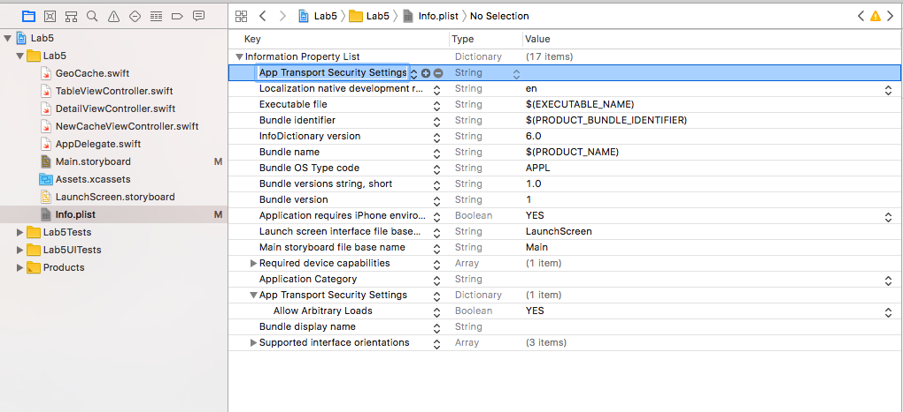

# CS 11 Swift/iOS
## Lab 5: Network Requests

---

In this assignment, we'll add the functionality of connecting to the network.
This is probably a little shorter than the last couple labs, but it involves
a couple of tricky asynchronous functions.

---

### The Server API:

I have a small server cobbled together to store GeoCaches. You can see
instructions on how to download and run your own instance of it
[here](serverInstructions.md) - I'm working on getting a server set up that
everyone can use, but for now you should try to get your own instance running
(it shouldn't be too hard).

### Allowing insecure connections

Your local server is not that secure - it doesn't allow https requests. By
default, iOS apps are _only_ allowed to make https requests, which is
generally a good default but makes testing harder. Here's how we allow
insecure HTTP requests. Go to the `Info.plist` file in your app. This stores
many settings like whether the app requests permission to use the camera,
location, other things, and if it does, what reason it gives the user when the
allow access dialog pops up. In the top row, `Information Property List`,
click the plus sign to the right of that to add a new entry. A text field
should pop up, and if you start typing you should be able to get it to
automatically fill in `App Transport Security Settings` after typing the first
part of that. Under `Type`, select `Dictionary`. Then, click the plus sign
on the new row to add a new entry to this dictionary. for `Key`, type in
`Allow Arbitrary Loads`, `Type`: `Boolean` and `Value`: `YES`. When you're
done, you should have an entry that looks like the second screenshot below:




---

We'll be using
fairly basic HTTP requests - don't worry if you're not familiar with some of
this stuff, we'll walk through it in Swift and it should be doable. Here's
a brief description of the API endpoints you'll need for this lab.

- `/createCache` - Send a POST request to this URL to add a cache to the
  database. The request should have a JSON object with these fields, largely
  mirroring what you've already written:
  {
    "id":,
    "title":,
    "details":,
    "creator":,
    "reward":
  }
  The object can also have a "latitude" and "longitude" field, but we'll get
  to that later.

- `/getCaches` - Send a GET request to this URL (no additional details needed)
  and the server will return a JSON array of objects like the above, with an
  additional "id" field, which is used in other API calls.

The server also stores images for each cache, which we will use in the next lab
to allow users of your app to take pictures of the locations they'll visit.

### Network Requests and JSON in Swift

Swift has a pretty straightforward way of doing network requests. You create
an object of type URLRequest using a url, like so:

```swift
var request = URLRequest(url: "http://localhost:5000/hello")
```

You can then set various properties of the
request, like httpMethod and httpBody.

```swift
request.httpMethod = "POST"
let data = try? JSONSerialization.data(withJSONObject: ["name": "noah"])
request.httpBody = data
```

You can set a value for arbitrary
http headers using the setValue method on your request object.

Once you have a request set up, you start it running _asynchronously_, meaning
the request doesn't take place on the main thread. This is
very important, because network requests can take a long time, and if they ran
on the main thread, the entire UI of the iPhone would lock up until the app
got a response from the server! By making the request asynchronously, the app
can handle the request whenever the user isn't doing anything that the UI needs
to immediately respond to.

Once you have a URLRequest set up, you make the request using a URLSession
object. These objects handle things like background downloads. If you don't
have complicated requirements for your requests (and we don't), you can use the simple `URLSession.shared` session, which is a singleton object for making
basic requests. You do this like so:

```swift
let task = URLSession.shared.dataTask(with: request, completionHandler: f)
```

This dataTask method takes a URLRequest object, as well as a function
(if you haven't seen functions taking functions as arguments before in some
context,
[here](https://medium.com/@Dougly/higher-order-functions-in-swift-sorted-map-filter-reduce-dff60b5b6adf)
is a good intro, and I also recommend CS4).
This function is a _callback_, which the shared session will run when the
request is finished and it gets a response from the server. Typically we will
use closure syntax to provide this callback - instead of defining a
function to handle the result of our network request, we use a closure (just
a function without a name defined only where it's needed), which looks like
this:

```swift
let task = URLSession.shared.dataTask(with: request, completionHandler: {
    data, response, error in
    if let error = error {
        print(error.localizedDescription ?? "Some kind of error")
        return
    }
    print(response)
    print(data)
})
```

There's a lot going on here - basically, the completionHandler function is
declared right in the call to dataTask. It takes three arguments: `data`,
`response`, and `error`, and returns nothing.
When it's called, `response` will be
the http response code that the server sent us (200, 404, etc).
`data` will be the response
data, and `error` will be a special error object if something went wrong with
the request for some reason. The error object is optional, so I've shadowed it
in the if statement so that we can deal with the error case separately.
`error` has a localizedDescription
property, but this is also an optional,
so I've used the nil coalescing operator ??
to make sure that print statement says something in case the error is incapable
of describing itself for some reason. If there is no error, the error argument
(which is an optional itself) will be nil, and the completionHandler will print
the response and data it got from the server.

Trailing closure syntax is something I really appreciate about Swift: if you
have a function call like this where the last argument is a closure, you can
write it outside of the function call's parentheses, like so:

```swift
let task = URLSession.shared.dataTask(with: request) {
    data, response, error in
    if let error = error {
        print(error.localizedDescription ?? "Some kind of error")
        return
    }
    print(response)
    print(data)
}
```

This helps to avoid some code ugliness that's very common in Javascript,
where you have a bunch of lines like this after every function call that uses
callbacks:

`
      });
    });
  });
});
`

It's not a huge deal, but it makes your code easier to read.

Once you have this task, just call `task.resume()` to start the network request.
When it's done, your completion handler will get called, and you're in business.

### Part A: Adding network requests to the model.

In this lab, you'll be making your app fetch and save geocaches from a server,
instead of from the UserDefaults stores on the user's phone. This way, all of
your users
can see the geocaches you create, and compete to find treasure or whatever!

The logical place to add this functionality is in the model, so open up the
GeoCache.swift file. First, we'll need to add an `id` field (of Int type)
to the GeoCache struct - the server needs this to uniquely identify GeoCaches.
You'll need to update the `init?(fromDictionary:)` method to take a
`[String: Any]` dictionary which also has an `"id":` field (this may require
additional casting from `Any` to `String` or `Int` depending on the dictionary
key), and you'll need to change the `dictionary` computed property to return
a `[String: Any]` dictionary that includes the `"id":` key also. For newly
created GeoCaches, we will let the NewCacheViewController give them a random
integer as an id - I'll supply the simple function that does this, which you
should put in your GeoCache.swift file:

```swift
func randomCacheId() -> Int {
    return Int(arc4random())
}
```

Next, write the following functions (still in GeoCache.swift):

- `func sendCacheToServer(\_ cache: GeoCache)`: This should take a geocache
object, serialize its dictionary representation in JSON, and send it to the
server by making a request to `serverURL/createCache` with a POST method
and a body which is the JSON data. This is not actually so complicated, but
you will have to use the
`JSONSerialization.data(withJSONObject: )`
function, and set the httpMethod and httpBody fields of the URLRequest.
You will also have to set the http header "Content-Type" to "application/json",
using the setValue(\_, forHTTPHeaderField:) method on your request object.

Then you must use URLSession.shared to make this request. Write a completion
handler, although the only thing it needs to do is print out an error
description if one occurs.

- `func loadCachesFromServer(onComplete: @escaping ([GeoCache]) -> ())`:
This is a complicated signature, so let's go through what this function
should do. Basically, it should make a GET request to the server at the
endpoint /getCaches. When this happens, the server collects all of the
GeoCaches in its database, and sends their JSON objects back to the requester.
Our loadCaches function will take that response data, try to convert it into
a Swift-compatible JSON object with

`JSONSerialization.jsonObject(with: data, options: [])`

then, try to cast that to the Swift `[[String: Any]]` type which we can loop
over and feed each dictionary to our `init?` method, creating a result array
of GeoCaches.

Now, in an ideal world this function would return that array of GeoCaches, but
then, whatever called the function would hang, waiting for the server to get
back to the loadCaches function! So instead, we allow callers of this function
to pass in their own completion handler, which can take an array of GeoCache
objects and do whatever it wanted to with those results. And this brings me
to the @escaping annotation - this means that the list of GeoCache objects
this function gives to the onComplete function _escapes_ from the loadCaches
function. What Swift would like to do with the result array is clean it up and
reclaim the memory it was using when the loadCaches function returns, but we
know that it'll be needed later by whatever completion handler someone passed
in, so we mark the handler as @escaping.

So, the final step of this function, once it has constructed an array of
GeoCaches, is to call the `onComplete` closure with the result array as its
only argument.

---

Now we're ready to integrate these calls into our app - the only file you
should need to change is TableViewController.swift (and one or two lines in
NewCacheViewController.swift). We're basically going to
replace our UserDefaults storage and loading with loading from and sending
to the server.

In `viewDidLoad()`, change the call to `loadCachesFromDefaults` to a call to
`loadCachesFromServer`. You can't assign the result of that function call
directly to your View Controller's array of Caches, since there is no result
of that function call! So, instead, you will need to pass
`loadCachesFromServer` a closure which sets the View Controller's array of
caches equal to the result of the network request (which is the first
argument to your closure).

This closure will also need to reload the table's
data (since new data has been pulled in, we need to tell iOS to redisplay
all of the cells in the table).
This is done with a call to `self.tableView.reloadData()`.

It sounds complicated, but my closure is only two lines at this point and it
works ok. You might notice that the new cells don't immediately display - you
may need to scroll the table view before anything shows up on startup of your
app. This is because our call to `self.tableView.reloadData()` takes place
in an _asynchronous_ callback - the reload happens on a lower-priorty thread
than the main thread, which handles UI events. To get the reload to happen
on the main thread (much faster), we need to use the main dispatch queue,
like so:

```swift
DispatchQueue.main.async {
    self.tableView.reloadData()
}
```

Then your table view should show new rows as soon as all of them are fetched
from the server.

The last thing to change is when a new cache is added, we don't want to add
it to the array and save to defaults, we want to add it to the array and
send it to the server. This should be a one-line change.

You'll also need to make a small change to NewCacheViewController - when it
constructs a new GeoCache in `prepare(for segue:)` it will need to give the
new cache a randomly chosen id (using the `randomCacheId()` function).

With that, you should be able to send your server caches, and get the list
of caches the server has.
