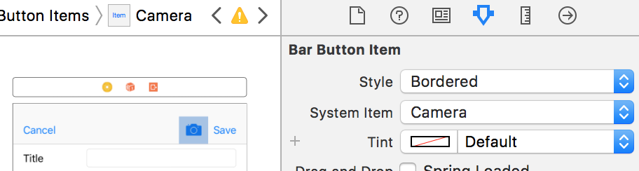
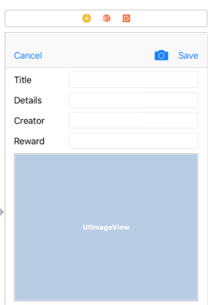

# CS 11 Swift/iOS
## Lab 6: Photo selection and display

---

In this assignment, we'll add a photo picker, so that creating a new geocache
will allow you to add a photo along with the cache and send it to the
server. This will be the last required assignment in the course, but it's
a little tricky, especially if you had trouble with Lab 5.

---

### Part A: Permissions

iOS has many strict security features, and maybe the most obvious to the
user are the permissions for things like camera, microphone, and location use.
Requesting these permissions from the user is not actually that hard - here's
how.

---

First, we'll need to add an entry to your app's info.plist file - this is an
XML file that contains a lot of metadata about your app, like its identifiers,
supported devices, and some privacy requirements.
It's where we enabled insecure HTTP connections in the last lab.
This is where you include
a description of why you need permissions you request - when you ask the user
if you can access the photo library, a string from your info.plist will be
presented. You can edit info.plist as an XML file, or you can use Xcode's
graphical editor. I find XML pretty hard to read, so I always just hit the
'+' button next to Information Property List, and it adds a new key. The key
you're looking for is "Privacy - Photo Library Usage Description". Its type
should be String, and you can write something in the value like
"To send pictures of your treasures to the server".

### Part B: Sending and Receiving Photos from the Server

We'll need an update to model - we need to add an image property to the
GeoCache struct, which should be optional, as not all GeoCaches will have
pictures. The Image type in UIKit is UIImage - we'll see a few of the things
it can do in this lab.

You'll need to do something really small to the server you're running for
it to support images. In the folder where you're running the server script
from (which should also have the server's database of caches), make a folder
called `Images`. This is where images for each GeoCache will be stored.

Sending a cache to the server must be updated a little bit so that the image
is also sent. Because images are much larger than the rest of the data of
the cache, we will do this in stages - send off a geocache with all its data
and unique ID, and, if the server says that succeeded, send the image to
match it. There's an endpoint in the cacheServer which adds a picture
associated with the
given GeoCache: `/addPicture?id=<id>` - to
use it, you need the cache ID you're trying to add a picture for, and you
put that at the end of the URL. You also need to attach as the body of the
HTTP request the JPEG file of the image.

Write this function in GeoCache.swift:

```swift
sendImage(id: Int, image: UIImage)
```

It should make a request to the server's `/addPicture` endpoint, as described
above. You will need to construct the URL with the given id at the end of it,
and set the request's `httpBody` property equal to the JPEG binary object
(This sounds complicated but you can get the JPEG data with the
```swift
UIImageJPEGRepresentation(_ image: UIImage, _ compressionQuality: CGFloat)
```
function - use a compression quality of around 0.25 for now to save some
bandwidth).

The completion handler for this request doesn't need to do anything besides
printing an error description, if an error occurs.

Now, your `sendCacheToServer()` function needs to check if the cache
was successfully sent, and if it was, and if the cache struct had a UIImage
in it (the optional image field was not nil), it needs to send that image
to the server using the function you just wrote. The server will return one of
two responses from `/createCache` in JSON: either ["Success"] or ["Failure"].
To check if the cache
was sent successfully, use the response object returned from the request
to `/createCache`, use `JSONSerialization.jsonObject` on it and cast the
result to `[String]`, and check if the first string in that list is "Success".
If all of these conditions are met, you can send the cache's image to the
sever with the `sendImage` function you wrote.

You also need a way to pull down images from the server. The server provides
an endpoint for this too, at `/getImage?id=<id>&img=<img_number>`, where you
substitute in the unique ID of the GeoCache you want the image for, and the
number of which image you want for it (we'll only support one image per
GeoCache for now numbered 0, but the server is built so that many pictures of
one spot could be sent and loaded).

Write this function in GeoCache.swift:

```swift
pullImageFromServer(id: Int, number: Int, onComplete: @escaping (UIImage) -> ())
```

You'll notice, like with `loadCachesFromServer`, we need an escaping closure
which takes the result and does what we want with it (handing it to a GeoCache
object or displaying it somewhere on the screen).

This function needs to construct a request to `/getImage` with the given
id and image number, and make a get request to it. In the completion handler
for this request, you need to construct a UIImage from the data returned
from the server, if any was returned (There's a UIImage constructor for this).
Then you need to call the `onComplete` closure with that UIImage as its
argument.

### Part C: Picking Photos

Next thing we'll do is to add a photo picker button to the New Cache View.
Pop open that storyboard, and put another navigation button on the bar of the
New Cache screen, in the System Item drop-down menu you can select
`Camera` to get a nice camera icon.



You should also add a UIImageView to this screen, so that the user can see
the photo they picked out before hitting save. Again, drag and drop.



Now, we can hook these up programmatically. You need to do a few things with
NewCacheViewController.swift to get an image picker working, here they are:

- Make the class NewCacheViewController conform to the
`UIImagePickerControllerDelegate` protocol (The syntax for this is the same
as making a class inherit from another class).

- Give the NewCacheViewController class a member, `picker`, which is
initialized as UIImagePickerController().

- Hook up those two UI elements we just added (the UIImageView needs an outlet,
and the new Bar Button Item needs an IBAction). I called the IBOutlet
`imagePreview`. The IBAction needs to do a couple of things to set up the
picker and show it to the user. It's boilerplate, so here is what my
IBAction does:
```swift
picker.allowsEditing = false
picker.sourceType = .photoLibrary
picker.mediaTypes = UIImagePickerController.availableMediaTypes(for: .photoLibrary)!
present(picker, animated: true, completion: nil)
```
These lines allow editing the photo before giving it to your app, and make it
pull from their photo library, as opposed to, say, the camera. Then the
picker is presented to the user.

- In its `viewDidLoad()` method, set `picker.delegate = self`.

- Now we need to add a couple of methods so that NewCacheViewController
conforms to the UIImagePickerControllerDelegate protocol. These are:

  - `imagePickerController(_ picker: UIImagePickerController, didFinishPickingMediaWithInfo info: [String: Any])`: This is called when an image is selected.
The way to get the selected image is to get
`info[UIImagePickerControllerOriginalImage]`
and cast it to UIImage. If this is successful, you can set the `image` property
of `imagePreview` to the chosen image. You should also set
`imagePreview?.contentMode = .scaleAspectFit`. After this, whether or not
it succeeded, you should dismiss the picker with
`dismiss(animated: true, completion: nil)`.

  - `imagePickerControllerDidCancel(_ picker: UIImagePickerController)`: This
can just dismiss the picker, the way you did in the former method.

- And, in the `prepare` for segue method, when you set up the cache the user
created, you can set the GeoCache object's `image` property to `imagePreview`'s 
`image`, which was set by the picker.

With that, you should be able to add images to the GeoCaches you create! But
we need a way to show them once they're created. We're going to add another
image view in the Detail View, and add logic to pull down the images from
the server.

### Part D: Displaying Photos

Let's start with displaying photos on the Detail View - it's easier. Just
drag a UIImageView onto it in the storyboard, add an outlet, and set the
Image View's `image` property equal to the cache's image, if it has one,
in the `viewDidLoad` method.

The next part may be a little tricky, because it's another instance of weird
asynchronous programming. In the TableViewController's viewDidLoad method,
after the caches are loaded from the server, loop over them, and for each
cache in the list of GeoCaches, call
`pullImageFromServer` with the cache's id, and image number 0. You should
pass in an onComplete closure that sets that cache's image equal to the
result (which will be the first argument of the onComplete closure).
Since GeoCache is a struct, you will need to loop over indices instead of
caches (since a standard for loop will copy each GeoCache, preventing its
image from being updated in the TableViewController's array).

### Optional Challenge

If you feel like making even more improvements, follow the instructions here:
[custom table cell](https://developer.apple.com/library/content/referencelibrary/GettingStarted/DevelopiOSAppsSwift/CreateATableView.html#//apple_ref/doc/uid/TP40015214-CH8-SW2) to subclass UITableViewCell and add image thumbnails to
the table cells.
