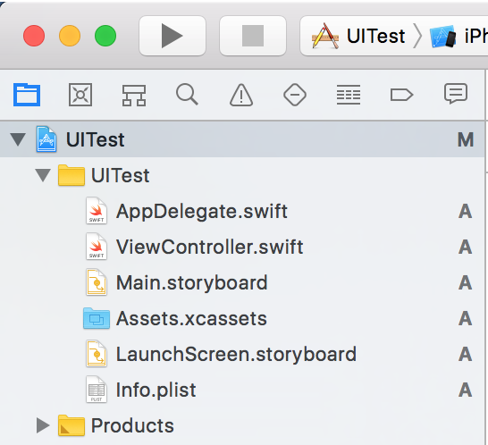
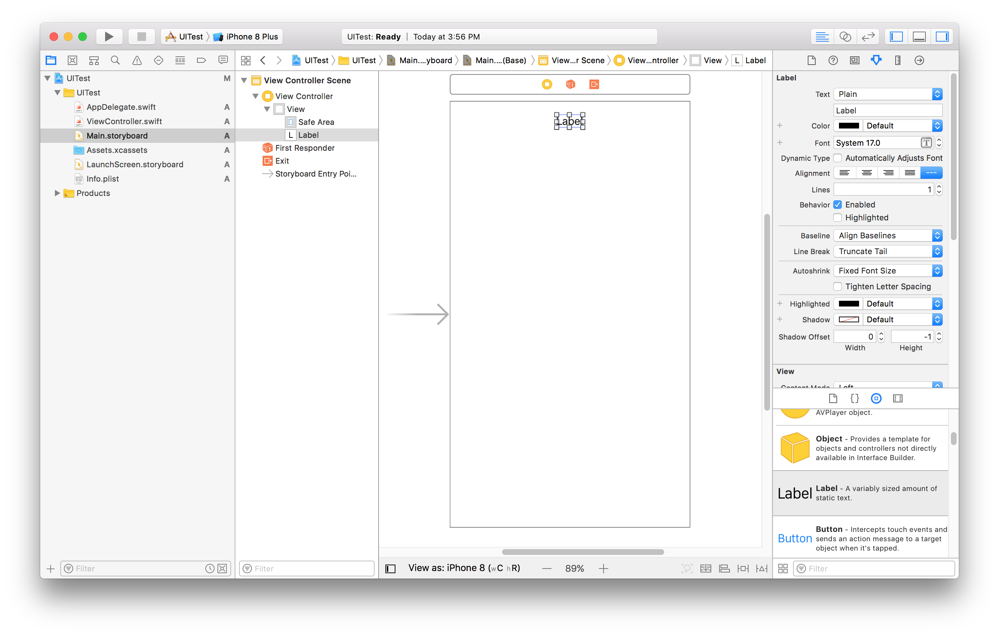
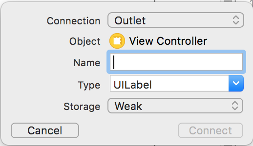
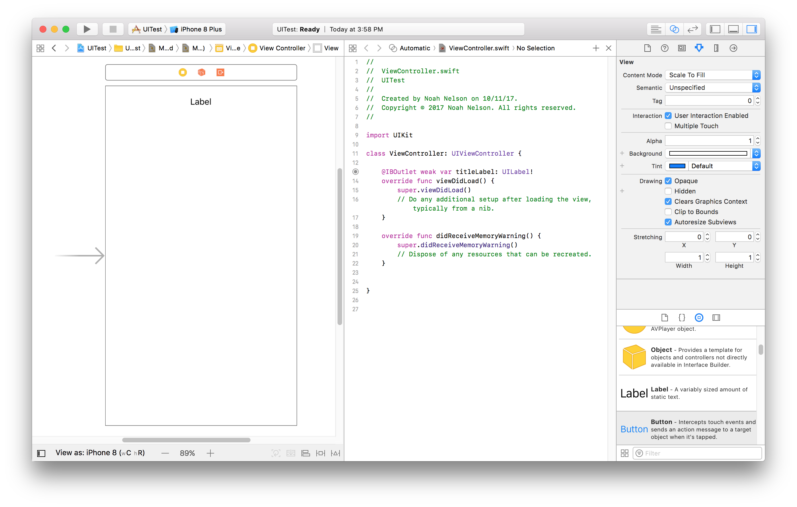
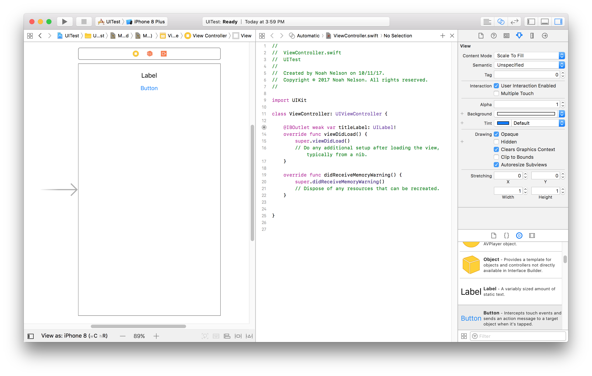
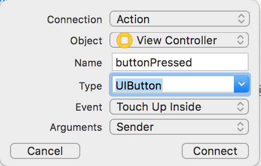
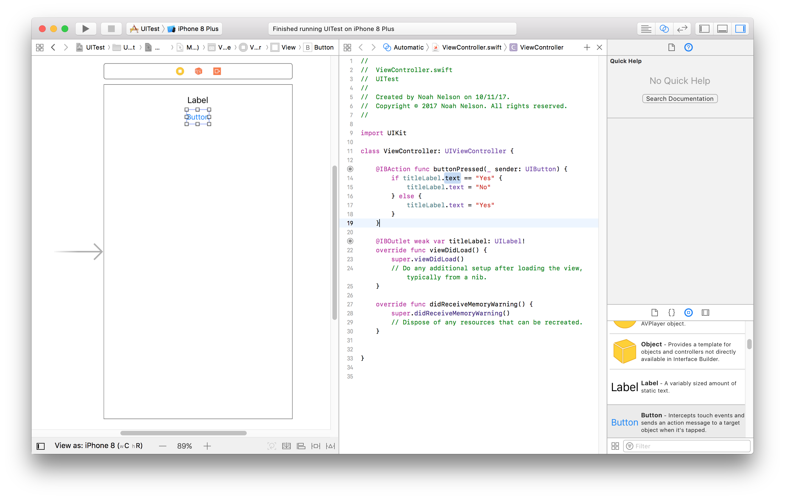
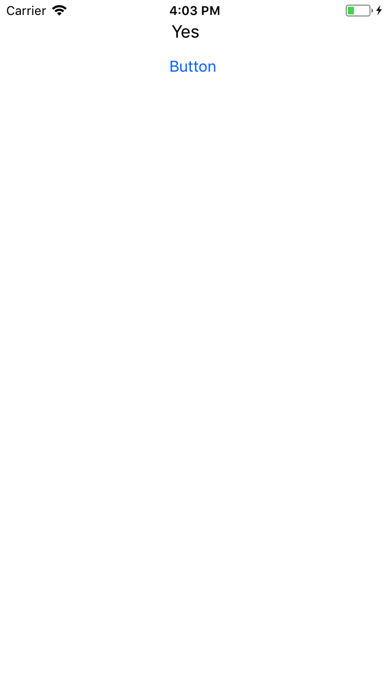
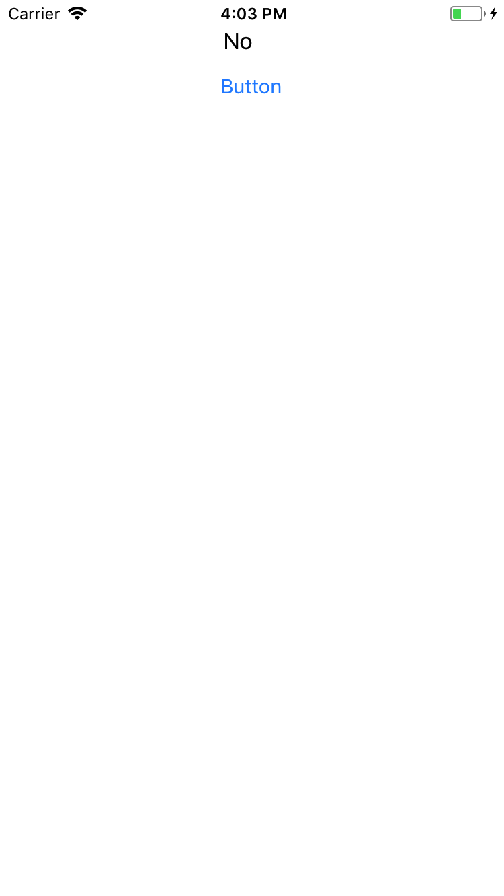

# Interface Builder Intro

Here's how to start building an iOS app from scratch, through to some really
basic functionality.

Open up Xcode - you may get a splash window, or no windows will open. Go to
File -> New -> Project, and select 'Single View Application' under iOS
Application. Hit next, give it a name like 'UI Test'. You might need to fill
in an organization name and identifier - you name should work (I usually use
Noah Nelson and com.nnelson). Select Swift for your language, and don't worry
about UI/Unit tests for now (although you should use them in your own
projects!). You'll pick a place for Xcode to put this project's folder (make
sure to create a Git repository as described [here](gitguide.md)), and it'll
create all the files you need for a basic application! On the left is a
list of those files, like in this screenshot:

Click on main.storyboard - this file is where you lay out the interface and the
views of your application. You should see a blank, iPhone-shaped rectangle
with an arrow leading into it.

Now you can start adding UI elements. The list at the bottom-right has many
of the things you'll need - let's start with a Label - just a little plain
text element. Find it in that list and drag one onto the top of your
application.

We'll need to hook that up to code if we want to do anything useful with it.
The ways of organizing an application like this are varied and highly debated,
but for now we'll put all of the code we write in the file called
'ViewController.swift'. We need to connect our new label to the code that
controls what the application displays to the user - this is also a fairly easy
drag and drop. Click the two circles button on the top-right, this will bring
up a second editor with the ViewController.swift file, which should have a few
functions in there just by default. While you're at it, hit the left-most
rectangle button to clear out the file navigator and get a little more space.

Now, you can control-drag from the label to *inside* the ViewController class.
A little dialog will pop up - fill in some name like 'titleLabel' but keep the
other defaults (UILabel type, Weak Storage).

This should cause a property of the ViewController class to be created, which
is annotated with the special @IBOutlet annotation, which signals that it
represents a connection to something on the user interface.
More info on connecting UI elements to View Controllers can be found
[here](https://developer.apple.com/library/content/referencelibrary/GettingStarted/DevelopiOSAppsSwift/ConnectTheUIToCode.html#//apple_ref/doc/uid/TP40015214-CH22-SW1).

Now we can
reference that in ViewController code to do things. But to have the user do
things, we need not only IBOutlets (which represent things that the user
*sees*), but also IBActions (which represent things the user can *do*). Let's
add a button to the UI - drag one onto the storyboard.

If you control-drag from the button to the ViewController class, you'll get a
similar dialog:

We fill it in like so, and this adds a whole *method* to our ViewController.
I've written a dumb thing for it to do (notice that I check and change the
text of the label by using its `.text` property):

Now you can hit the play triangle button at the top left to run your app!
Here's a few screenshots of what it does.

Note - in Lab 2 you will need to also use Text Fields - these are much like
labels where you connect them to your ViewController using an IBOutlet and
get what the user has entered through their `.text` field.
